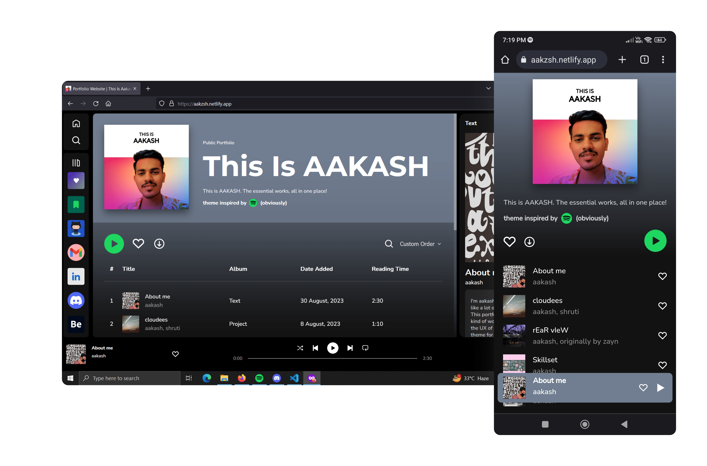

# Portfolio Website | This Is AAKASH
This repository contains the source code of the portfolio website that I've made for myself. The theme is completely (as in 100%) inspired by Spotify and is kept intuitive. The project is made using the amazing javascript framework Vue, and is deployed on Netlify as well as GitHub pages. 

# Screenshots


## Project setup
```
npm install
```

### Compiles and hot-reloads for development
```
npm run serve
```

### Compiles and minifies for production
```
npm run build
```

### Lints and fixes files
```
npm run lint
```

### Customize configuration
See [Configuration Reference](https://cli.vuejs.org/config/).
